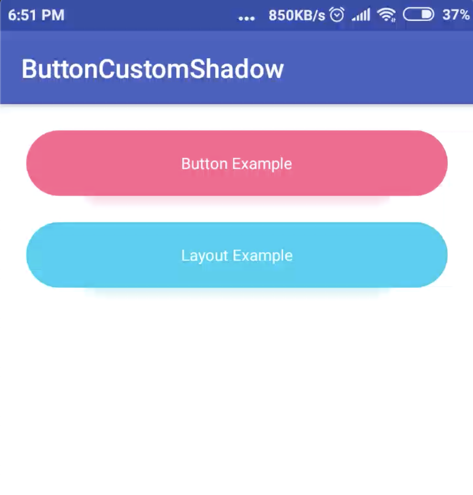

[  ](https://bintray.com/subsub/maven/buttoncustomshadow/_latestVersion)

[](https://android-arsenal.com/details/1/7165)

# What's New (1.1.0)
- **Beauty Layout, so you can make beautiful shadow on layout**
- **Accessible attributes through java/kotlin, so you can call custom shadow attributes inside your java/kotlin code**


# Beauty Shadow Button




## Usage
Add dependency into app build.gradle
```
compile "com.subsub.libs:buttoncustomshadow:{latestVersion}"
```

If gradle failed to sync, try adding maven repository into project build.gradle
```
buildscript{
    repositories {
        maven {
            url  "https://dl.bintray.com/subsub/maven" 
        }
    }
}
```

## Sample
See `app` module

#### Add BeautyButton into layout
```xml
<com.subsub.library.BeautyButton
        android:id="@+id/button"
        android:layout_width="0dp"
        android:layout_height="50dp"
        android:layout_margin="20dp"
        android:background="@drawable/bg_round_30dp_accent"
        android:elevation="10dp"
        android:padding="10dp"
        android:textColor="@color/colorWhite"
        app:layout_constraintEnd_toEndOf="parent"
        app:layout_constraintStart_toStartOf="parent"
        app:layout_constraintTop_toTopOf="parent"
        app:shadowColor="@color/colorAccent"
        app:shadowPercentHeight="0.7"
        app:shadowPercentWidth="0.75"
        app:shadowRadius="30dp"
        app:shadowYOffset="14"
        app:text="Button" />
```


#### Attributes
Name | Type | Description
--- | --- | ---
`shadowRadius` | Dimension | This attribute (combined with elevation) determines how spread apart the shadow should be. ShadowRadius also determines the amount of corner radius (roundness) of the shadow. The bigger the shadowRadius is, the bigger the corner radius. ShadowRadius should be equal or bigger than elevation.
`shadowColor` | Color | The color of the shadow
`shadowXOffset` | Float | Sets shadow horizontal (x) position relative to the view.
`shadowYOffset` | Float | Sets shadow vertical (y) position relative to the view.
`shadowPercentWidth` | Float | Sets the percentage of shadow's width relative to the button width. Value is between 0 and 1, with 0 being 0% and 1 being 100% (shadow width = button width)
`shadowPercentHeight` | Float | Sets the percentage of shadow's height relative to the button height. Value is between 0 and 1, with 0 being 0% and 1 being 100% (shadow height = button height)

#### Accessing attributes from java
All custom attributes can be accessed through java like below:
```
// set elevation
button.myElevation = activity.viewElevation

// set shadow radius
button.customShadowRadius = activity.viewShadowRadius

// set xOffset
button.xOffset = activity.viewXOffset

// set yOffset
button.yOffset = activity.viewYOffset

// set percent height
button.shadowHeight = activity.viewShadowHeight

// set percent width
button.shadowWidth = activity.viewShadowWidth
```
